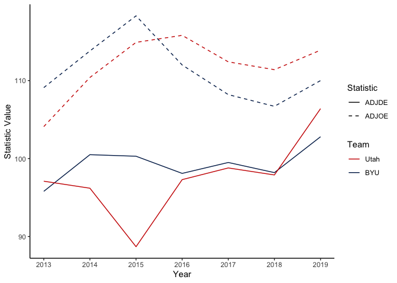
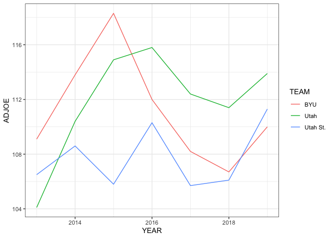

<!-- README.md is generated from README.Rmd. Please edit that file -->

# bracketpredictr

<!-- badges: start -->

[](https://github.com/sethbeckett/bracketpredictr/actions/workflows/R-CMD-check.yaml)
<!-- badges: end -->

## Introduction

The `bracketpredictr` package offers a comprehensive set of functions
for analyzing Division I college basketball stats, from 2013 to 2019.
The package allows users to easily retrieve team and game stats for a
given season or multiple seasons and predict the winners of upcoming
games. This can be particularly helpful for those interested in
performing in-depth analysis on college basketball performance and
making informed predictions for tournaments such as the NCAA March
Madness. You can find the Github repository for this package
**[here](https://github.com/sethbeckett/bracketpredictr)**\[<https://github.com/sethbeckett/bracketpredictr>\].

## Installation

To install `bracketpredictr`, use the following commands for installing
from github or locally:

``` r
# For installing from GitHub
# install.packages("remotes")
# remotes::install_github("sethbeckett/bracketpredictr")
```

## Data - `cbb.csv` (College Basketball Dataset)

This is a combined dataset of Division I basketball teams, across 6
seasons, and 22 variable stats (such as ORB, ADJOE, and SEED). It
includes the years 2013-2019, with 2020 specifically not included in the
dataset because of a lack of a postseason due to COVID-19. 2013-2019 was
manipulate (cleaned) with the intent of just those years being analyzed
together, so for the sake of consistency, the year 2021 was omitted from
being added.

### Source of Data

*Andrew Sundberg. (3/15/2021). College Basketball Dataset, Version 4.
Retrieved 3/31/2023 from
<https://www.kaggle.com/datasets/andrewsundberg/college-basketball-dataset>*

## Example Usage

Here are some examples of how to use the functions provided by the
`bracketpredictr` package:

### Retrieving Team Stats

To retrieve the names of all available team stats, you can use the
`get_stats_names()` function:

``` r
library(bracketpredictr)
get_stats_names()
#>  [1] "CONF"       "G"          "W"          "ADJOE"      "ADJDE"     
#>  [6] "BARTHAG"    "EFG_O"      "EFG_D"      "TOR"        "TORD"      
#> [11] "ORB"        "DRB"        "FTR"        "FTRD"       "X2P_O"     
#> [16] "X2P_D"      "X3P_O"      "X3P_D"      "ADJ_T"      "WAB"       
#> [21] "POSTSEASON" "SEED"      
#> For more information on specific statistics,
#>         see the cbb documentation by running '?cbb'.NULL
```

This will output a list of all available teams, sorted alphabetically.

To retrieve team stats for one or more teams, use the `get_team_stats()`
function:

``` r
teams <- c("Duke", "North Carolina", "Kentucky")
stats <- c("TEAM", "W", "ADJOE", "ADJDE")
years <- seq(2013, 2019)

get_team_stats(teams, stats, years)
#>              TEAM  W ADJOE ADJDE YEAR
#> 1            Duke 30 118.4  91.5 2013
#> 2        Kentucky 21 109.7  96.7 2013
#> 3  North Carolina 24 111.6  93.0 2013
#> 4        Kentucky 29 117.2  96.2 2014
#> 5  North Carolina 24 113.4  94.7 2014
#> 6            Duke 26 125.9  98.6 2014
#> 7            Duke 35 125.2  90.6 2015
#> 8        Kentucky 38 120.3  84.0 2015
#> 9  North Carolina 26 119.6  92.5 2015
#> 10 North Carolina 33 123.3  94.9 2016
#> 11       Kentucky 27 123.2  95.1 2016
#> 12           Duke 25 121.2  98.9 2016
#> 13 North Carolina 33 121.0  91.5 2017
#> 14       Kentucky 32 118.3  91.3 2017
#> 15           Duke 28 122.1  95.6 2017
#> 16           Duke 29 122.3  92.9 2018
#> 17 North Carolina 26 120.7  97.1 2018
#> 18       Kentucky 26 115.8  95.6 2018
#> 19           Duke 32 118.9  89.2 2019
#> 20       Kentucky 30 117.5  89.8 2019
#> 21 North Carolina 29 120.1  91.4 2019
```

This will output a table showing the requested stats for the specified
teams and years. If only wanting one team, stat, or year, you can input
just that individual item instead of a vector.

### Predicting Game Winners

To predict the winner of a game between two teams, use the
`predict_winner()` function:

``` r
team1 <- "Utah"
team2 <- "BYU"
stats <- c("ADJOE", "ADJDE")
year <- 2019

predict_winner(team1, team2, stats, year)
#> [1] "Utah"
```

This will output the predicted winner of the game based on the specified
team stats, and year.

### Plotting Team Stats

One convenient way our package can be used is to plot two teams’
statistics over time, using our `plot_stats()` function. In this
example, we’ll use the the variables defined in the previous example to
plot ADJOE and ADJDE of Utah vs BYU over time. This plot fucntion also
correctly maps teams names to their corresponding colors, as can be seen
below.

``` r
plot_stats(team1, team2, stats)
```



Alternatively, one could use ggplot to do something similar if plotting
the statistics of more teams is desired. For example, let’s compare
Utah, BYU, and Utah St. ADJOE.

``` r
library(ggplot2)

ut_adjoe <- get_team_stats(c("Utah", "BYU", "Utah St."), "ADJOE")

ggplot(ut_adjoe, aes(x = YEAR, y = ADJOE, color = TEAM)) +
  geom_line() +
  theme_bw()
```



## Conclusion

The `bracketpredictr` package offers a efficient and convenient set of
functions for analyzing college basketball stats. This can be done by
getting team stats, making predictions on tournaments based on previous
games, and more applicable functions. By providing easy access to past
data and predictive capabilities, it enables users to conduct in-depth
analyses and make well-informed predictions for college basketball
tournaments in the future.
